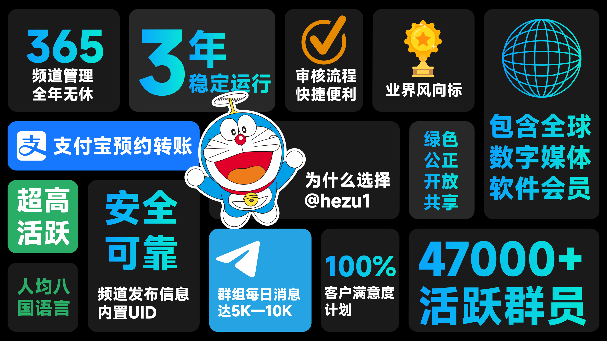

<h1 align="center">
  
合租Wiki

  
</h1>

    <a href="https://t.me/hezu1"></img></a>
    <a href="https://t.me/hezu2"></img></a>

## TODO
- [ ] 文档搜索
- [ ] SideBar
- [ ] i18n
- [ ] 主题美化

## 参与贡献
1. 点击右上角 `Fork` 本仓库
2. 本地构建修改后推送到 Github
3. 提交PR,等待`merge`
4. 如果是修改主题方面的，请将页面预览图发送给 [犬来八荒🌸](https://t.me/ShadowsSide)，我会按照需求进行合并

## 贡献者

感谢所有为这个项目作出贡献的人!  

 
